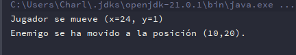
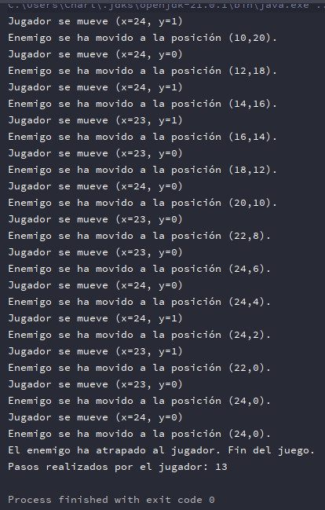

# PersecucionVirosms


## Descripción del Proyecto

Este proyecto es una aplicación de juego de persecución desarrollada en Java utilizando el framework Swing para la interfaz de usuario. La aplicación muestra un tablero de juego donde un jugador se mueve para evitar ser atrapado por los enemigos.

La aplicación consta de tres clases principales:

- `Juego`: Esta es la clase principal que inicia el juego y maneja la lógica del juego.

- `Jugador`: Esta clase representa al jugador en el juego. El jugador puede moverse en el tablero de juego y es perseguido por los enemigos.

- `Enemigo`: Esta clase representa a los enemigos en el juego. Los enemigos persiguen al jugador en el tablero de juego.

## Screenshots

 


## Configuración

Para ejecutar este proyecto, necesitarás tener instalado IntelliJ IDEA y el JDK de Java en tu máquina.

## Dependencias

Este proyecto depende de la biblioteca estándar de Java y no requiere ninguna dependencia adicional.

## Ejecución

Para ejecutar este proyecto, abre el proyecto en IntelliJ IDEA y haz clic en el botón "Run" en la barra de herramientas. Asegúrate de tener configurado el JDK de Java para ejecutar la aplicación.

## Cómo funciona

Cuando ejecutas la aplicación, se inicia el juego. El jugador se mueve en el tablero de juego y es perseguido por los enemigos. El juego termina cuando un enemigo atrapa al jugador.

## Estructura del Proyecto

El proyecto consta de varios archivos principales:

- `Juego.java`: Esta es la clase principal que inicia el juego y maneja la lógica del juego.

- `Jugador.java`: Esta clase representa al jugador en el juego. El jugador puede moverse en el tablero de juego y es perseguido por los enemigos.

- `Enemigo.java`: Esta clase representa a los enemigos en el juego. Los enemigos persiguen al jugador en el tablero de juego.

## Contribuciones

Las contribuciones a este proyecto son bienvenidas. Si encuentras un error o tienes una sugerencia para mejorar el proyecto, por favor abre un issue o envía un pull request.

## Licencia

Este proyecto está licenciado bajo los términos de la licencia GNU GENERAL PUBLIC LICENSE. Para más detalles, consulta el archivo [GPL-3.0 license](https://github.com/VirosMortais/PersecucionVirosMs?tab=GPL-3.0-1-ov-file) en el directorio raíz del proyecto.

## Instalación

Para instalar este proyecto, necesitarás tener IntelliJ IDEA y el JDK de Java instalados en tu sistema. Aquí están los pasos para instalar y ejecutar el proyecto:

1. Clona el repositorio en tu máquina local usando Git:

```bash
git clone https://github.com/VirosMortais/persecucionvirosms.git
cd persecucionvirosms
```

2. Abre el proyecto en IntelliJ IDEA.

3. Ejecuta el proyecto haciendo clic en el botón "Run" en la barra de herramientas de IntelliJ IDEA.

## Acknowledgements

- [Awesome Readme Templates](https://awesomeopensource.com/project/elangosundar/awesome-README-templates)
- [Awesome README](https://github.com/matiassingers/awesome-readme)
- [How to write a Good readme](https://bulldogjob.com/news/449-how-to-write-a-good-readme-for-your-github-project)

## Authors

- [@VirosMortais](https://github.com/VirosMortais)
